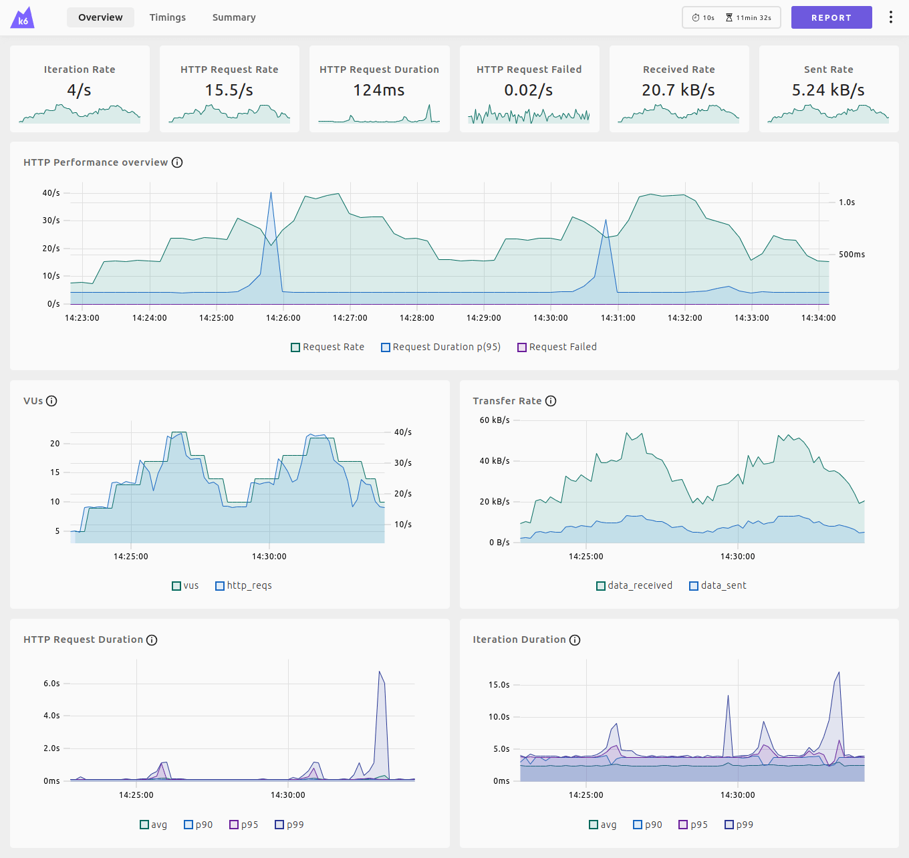

# Web dashboard



[Documentação Web dashboard](https://grafana.com/docs/k6/latest/results-output/web-dashboard/)

## script.js

    import http from 'k6/http';
    import { check, sleep } from 'k6';

    export const options = {
    stages: [
        { duration: '10s', target: 10 },
        { duration: '10s', target: 20 },
        { duration: '10s', target: 0 },
    ]
    };

    export default function () {
    const res = http.get('https://test.k6.io/');
    check(res, { 'status was 200': (r) => r.status == 200 });
    sleep(1);
    }

## Executar o script

```bash
K6_WEB_DASHBOARD=true k6 run script.js
```

## Abrir o link no browser

web dashboard: `http://127.0.0.1:5665`
